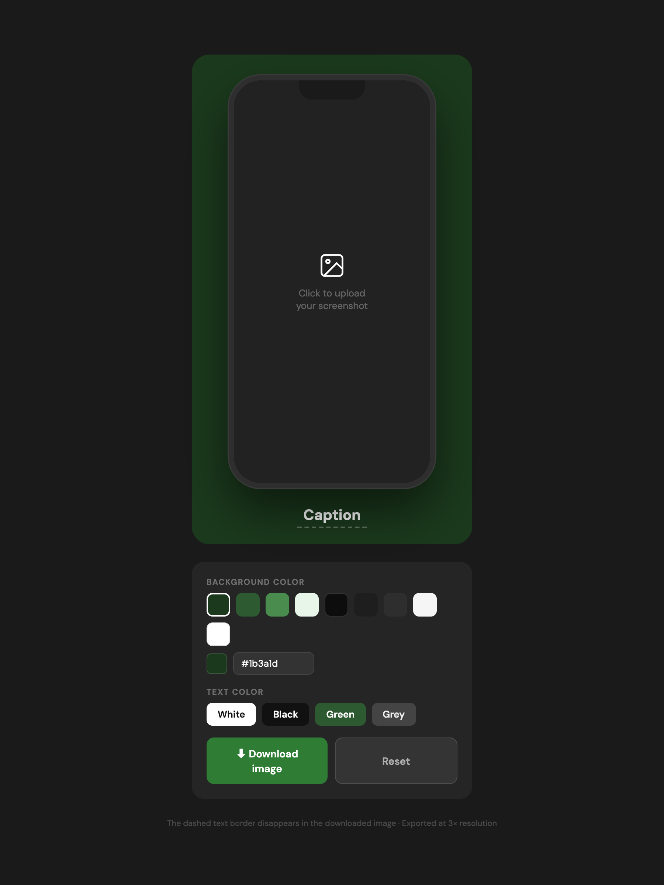
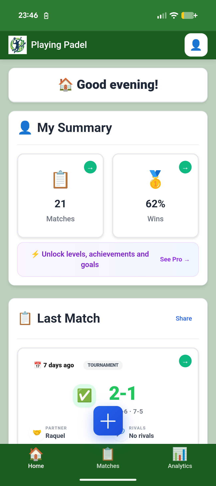
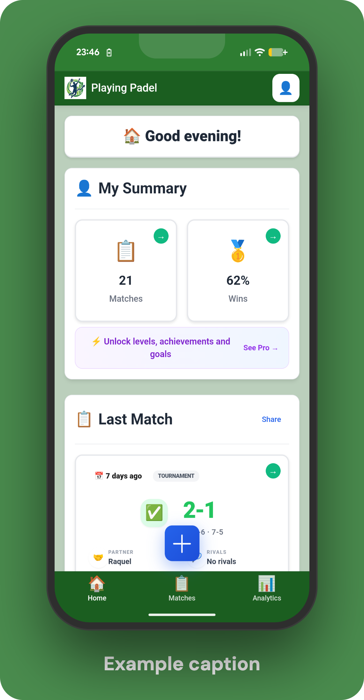

# Mobile Image Generator


[](https://github.com/alazaroc/mobile-image-generator/pulls)

Two tools in one:

1. **Wrap your app screenshots in a phone frame** — adds a realistic phone mockup, a background color, and a caption text, ready for app store listings or marketing pages.
2. **Convert images to WebP** — batch-converts PNG/JPG to WebP with optional resizing, to reduce file size for the web.

---

## Preview

### Interactive UI (`mockup-playstore.html`)

Open the HTML file directly in a browser. Upload a screenshot, pick a color, type a caption, and download the result.



### CLI: before and after

| Your screenshot | With phone frame + caption |
| --- | --- |
|  |  |

---

## Requirements

- Node.js ≥ 18
- `cwebp` — only needed for WebP conversion: `brew install webp`

## Setup

```bash
npm install
```

---

## Tool 1 — Generate phone mockups

Scans `images/original/` recursively, wraps every PNG/JPG in a phone frame, and saves the result to `images/generated-with-mobile-format/` preserving the same folder structure.

```bash
npm run generate
npm run generate -- --color "#1b3a1d"   # custom background color
```

**Configure captions:** edit [captions.json](captions.json). Key = relative path from `images/original/`, value = caption text. Images without an entry are processed with no caption.

```json
{
  "en/home.png": "Your summary at a glance",
  "es/home.png": "Tu resumen de un vistazo"
}
```

---

## Tool 2 — Convert to WebP

Converts images from a source folder to WebP format (with optional resizing) and saves them to `images/converted-to-webp/`.

```bash
npm run convert:original    # converts images/original/   → images/converted-to-webp/original/
npm run convert:generated   # converts images/generated-with-mobile-format/ → images/converted-to-webp/generated/
```

Options (append after `--`):

```bash
npm run convert:generated -- -w 800      # resize to 800px wide (default: 600)
npm run convert:generated -- -q 90       # WebP quality 0-100 (default: 85)
npm run convert:generated -- --no-resize # convert format only, no resize
```

---

## Full pipeline

Run both tools in sequence — generate mockups, then convert them to WebP:

```bash
npm run all
```

---

## Folder structure

```text
images/
├── original/                        # ← Place your screenshots here (any subfolder depth)
│   └── example/                     # Example included in repo
├── generated-with-mobile-format/    # ← Output of npm run generate
└── converted-to-webp/
    ├── original/                    # ← Output of npm run convert:original
    └── generated/                   # ← Output of npm run convert:generated
```

---

## Maintainer

**Alejandro Lazaro Chueca** — [@alazaroc](https://github.com/alazaroc) on GitHub.

Open an [issue](https://github.com/alazaroc/mobile-image-generator/issues) or a [pull request](https://github.com/alazaroc/mobile-image-generator/pulls) for questions, bugs, or contributions.

## License

[MIT](LICENSE)
